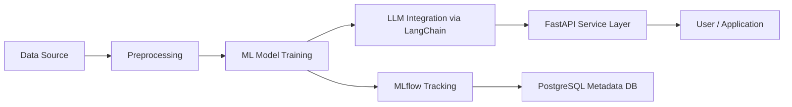

# 🚀 LLM-Integrated ML Pipeline

An end-to-end machine learning pipeline enhanced with **Large Language Model (LLM)** integration for automated experiment tracking, orchestration, and intelligent evaluation.  
This project demonstrates how to combine **classical ML workflows** with **modern LLM capabilities** to accelerate model development and deployment.

---

## ✨ Features

- 🔹 **End-to-End ML Workflow**: Covers data preprocessing, training, validation, and deployment.
- 🔹 **Experiment Tracking**: Integrated **MLflow** for logging hyperparameters, metrics, and artifacts.
- 🔹 **LLM Integration**: Used **LangChain + Hugging Face APIs** for automated report generation and contextual analysis.
- 🔹 **API Orchestration**: Exposed services via **FastAPI** for model inference and LLM-enhanced responses.
- 🔹 **Containerized Deployment**: Dockerized services for portability and scalability.
- 🔹 **Database Layer**: PostgreSQL used to persist experiment metadata and model registry.
- 🔹 **Cloud Ready**: Deployed on **AWS EC2** with support for scaling pipelines.

---

## 🛠️ Tech Stack

- **Languages:** Python
- **Frameworks:** FastAPI, LangChain
- **ML Ops:** MLflow, Hugging Face
- **Storage:** PostgreSQL, AWS S3
- **Deployment:** Docker, AWS EC2

---

## ⚙️ Architecture

## 📈 Workflow

Data Ingestion & Preprocessing

Load structured datasets

Apply cleaning, normalization, and feature engineering

Model Training & Tracking

Train models with MLflow tracking

Log hyperparameters, metrics, and artifacts

LLM-Assisted Evaluation

Generate automated insights using Hugging Face LLMs

Context-aware feedback loop for improving ML results

Deployment

Containerized pipeline using Docker

FastAPI endpoints for model inference and orchestration

PostgreSQL for storing experiment runs

📊 Example Use-Cases

Automated ML experiment documentation with LLM-generated summaries

Predictive model training with tracked performance history

LLM-assisted debugging of failed runs

Interactive FastAPI endpoints for pipeline execution

🚀 Getting Started

1. Clone the repo
   git clone https://github.com/mihir2004/LLM_ML_PIPELINE.git
   cd LLM_ML_PIPELINE

2. Build Docker containers
   docker-compose up --build

3. Run the pipeline
   uvicorn app.main:app --reload

🧑‍🔬 Future Work

Integration with Kubernetes for large-scale deployment

Adding LLM-based hyperparameter optimization

Support for multi-model ensembles

Extending PostgreSQL layer with a full-featured Model Registry

📄 License

MIT License © Mihir Kasare

---

🔥 This README gives recruiters and collaborators a **clear picture of your pipeline** → architecture, stack, workflow, and future directions.

Do you want me to also **add sample API usage (FastAPI endpoints + example request/response)** in the
